# PP5-eCommerce-Tourbillon
Tourbillon is a fictional e-commerce watch reseller based in Ireland. They specialise in luxury timepieces for men and women. 

That this website is for educational purposes only and the credit card payment functionality is not set up to accept real payments. If testing interactively, feel free to use card details below. Further information can be viewed via Stripe documentation test page.

4242424242424242 (Visa) Expiration date = Any future date (Example: 12/24) CVN = any 3 digits (Example: 132) Postcode = any 5 digits (Example: 12345)

# Strategy Plane

The world of acquiring watches is growing and people are seeking for their wholy grail for different reasons (eg: fashion, passion, or investment). Watch seekers are looking for specific watches on different channels in order to be the first ones to acquire their next piece. 

## App's Goals

* To provide the users with a pleasant experience on the website where they read more about the offered watches.
* To provide users with an intuitive and secure checkout process to purchase the imtes they are interested in.
* To allow users to share their thoughts on their favorite items.
* To allow the store admin users to approve, update and delete reviews from the frontend.
* To provide users with clear and adequate responses based on their input or actions.

## Site User / Target Audience / Demographic

* Target market is aimed at anyone interested in luxury watches.
* People who may have acquired or are looking to acquire their next timepiece.
* People who are interested in horology.

# Scope Plane

## User Experience (UX)

### User Stories

The user stories are categories in 3 classes of users:
- Visitor, as a user visiting the website and discovering the brand and the services of the app,
- Customer, as a user that is logged in,
- Store Administrator, as a superuser with full access.

1. As a <strong>Visitor</strong>, I can:
    01. Understand the purpose of this website from the homepage,
        * to identify the value proposition.
    02. Navigate around the site and easily find the desired content,
        * to access information that I look for.
    02. View the list of products and filter lists on chosen categories,
        * to identify items that I find interesting.
    03. Search for products to find a specific item on the app,
        * to easily consult information on specific items.
    04. Click on a product to view its details,
        * to read more on items I find interesting.
    06. View product ratings and comments so that I can read other users' opinions,
        * to be better informed on other Tourbillon's users experience of this specific product.
    05. Register for an account to access the services available to members.
        * to have a personalised account and access restricted areas of the site based on my profile.
    06. Add a product to my shopping bag,
        * to purchase items I wish to acquire.
    07. Access my shopping bag,
        * to update quantities or remove items and view the total cost.
    07. Buy a product by using the website checkout system,
        * to check out quickly and in a secure environment.
    08. Signup for the newsletter,
        * to stay up to date with the latest addition to Tourbillon's catalog.
    <br>
    <br>
2. As a <strong>Customer</strong>, I can:<br>
    01. View my previous orders,
        * to keep track of my previous purchases.
    02. Post a review on a product,
        * to share my experience and thoughts with Tourbillon's community.
    03. Update or Delete a previously posted review.
        * to own the content that I post on Tourbillon's app. 
    04. Save my information to my profile,
        * to make the checkout process easier for future purchases.
    06. Checkout without having to fill in my previously saved information,
        * to make the checkout process more seamless and improve the customer experience.
    <br>
    <br>

3. As a <strong>Store Administrator</strong>, I can:
    01. Create a draft of a new product,
        * to work on products on the backend.
    02. Manage products,
        * to keep product information up to date and publish only selected products on the website.
    03. Create & manage categories,
        * to link products to categories and make product filtering easier.
    04. Delete products & categories,
        * to remove categories that are no longer going to be used.
    06. Approve users' published reviews,
        * to manage the community engagement and only allow useful comments to be posted.
    07. Publish and manage a FAQ visible on the website,
        * to allow users to find up-to-date information on the questions they ask themselves.

## Agile Methodology

The principles of the Agile Methodology framed how this project was tackled. The GitHub project management tools were used to keep track of the different sprints. They can be found [here](https://github.com/users/nfepb/projects/5/views/2?visibleFields=%5B%22Title%22%2C%22Status%22%2C%22Labels%22%2C%22Milestone%22%5D).

The status of the issues tracked through 3 different sections:

* 📚 Backlog
* 🚧 In Progress
* ✅ Done

The websites of several watch houses helped me define what were some of the critical features to get to a MVP, and which features were considered 'nice to have' for later development. The ones this project takes most inspiration from in terms of features are the [Longines](https://www.longines.com/), the [Rolex](https://www.rolex.com/), and the [Chrono24](https://www.chrono24.fr/) websites.

# Structure Plane

## Database Diagram & Sitemap


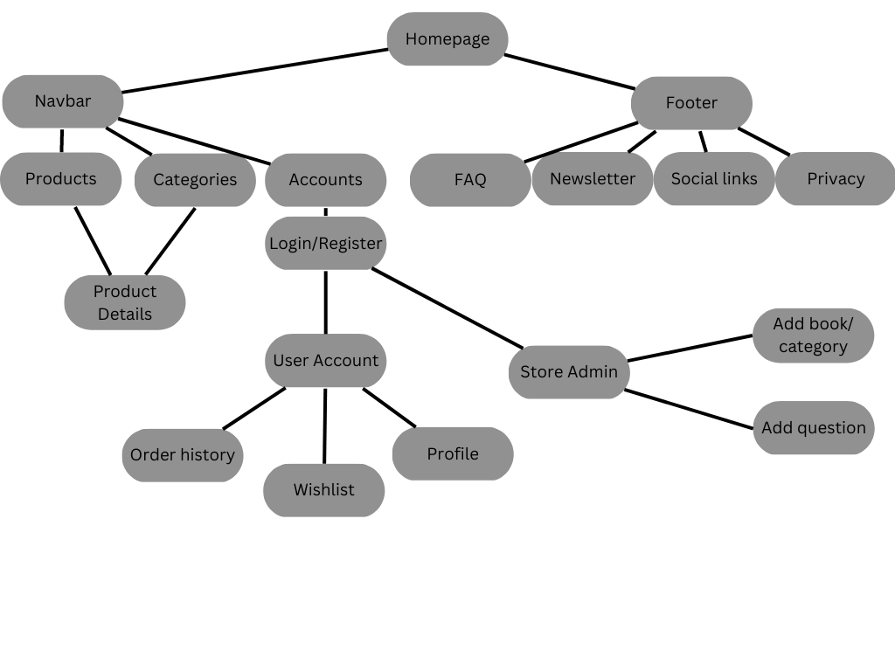

## Typography

* <i>Monsieur La Doulaise</i> is used for the site logo.
* <i>Homemade Apple</i> is used for site titles.
* <i>Montserrat</i> is used for the rest of the content of the site, including headers.

## Colours


The name of the app, "Tourbillon" has two definitions. In watchmaking (or horology), it defines a type of watch escapement to increase the accuracy. In French, a tourbillon is used to define a whirlwind. The main colour chosen, Prussian Blue, Pacific Blue, and White are used to reference colour of the sea in turmoil. The Columbia Blue and Cafe Noir are there to reference respectively the casing foa watch, along with its brown leather strap.

## Images

All images from from the Unsplash website and the Watchbase database.

## Wireframes

The mobile and desktop for this project can be found [here]()

# Surface Plane

## Features

### Navbar

* The navigation bar appears on every page so users can easily navigate through the site
* Navigation bar has links for 'Home', 'All Products', 'Categories', 'Gender', 'More' and icons for account and bag, along with a search bar.
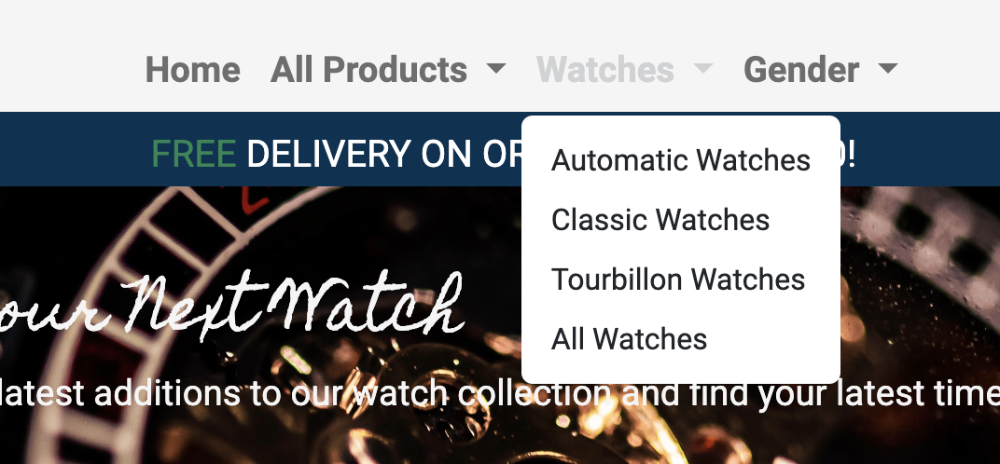

### Footer

* Appears on every page and contains FAQ's, Shipping Info, Privacy Policy, Subscribe form, and Social links
* Social links are opened in a new tab to avoid sending users away from our site


### Home Page

* The Login/Register feature is located in the upper right corner and offers the user to log in or register for an account as well as log out of the site
* When the user is logged in links for 'Login' and 'Register' will change to 'My Profile', 'Logout' and add Whishlist
* The admin user has extra access that allow them to add, update and remove products from the store
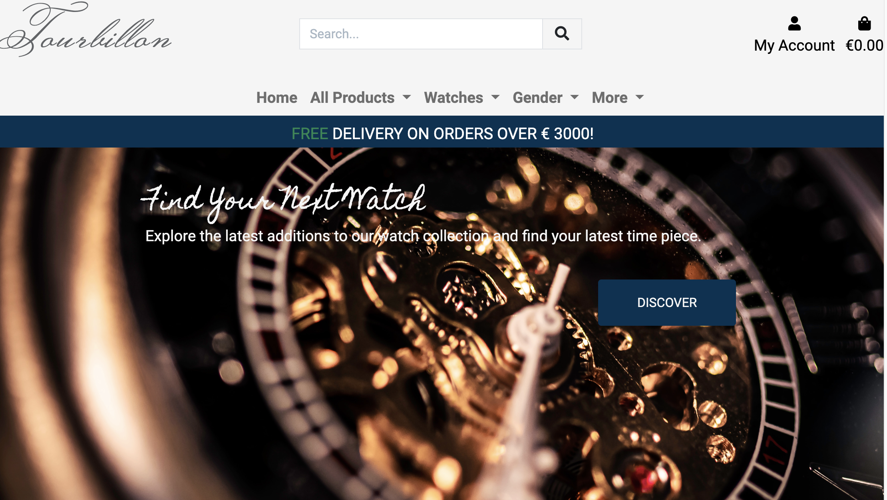

### Login Page

* The Login/Register feature is located in the upper right corner and offers the user to log in or register for an account as well as log out of the site
* When the user is logged in links for 'Login' and 'Register' will change to 'My Profile', 'Logout'
* The admin user has extra access that allow them to add, update and remove products & categories from the store
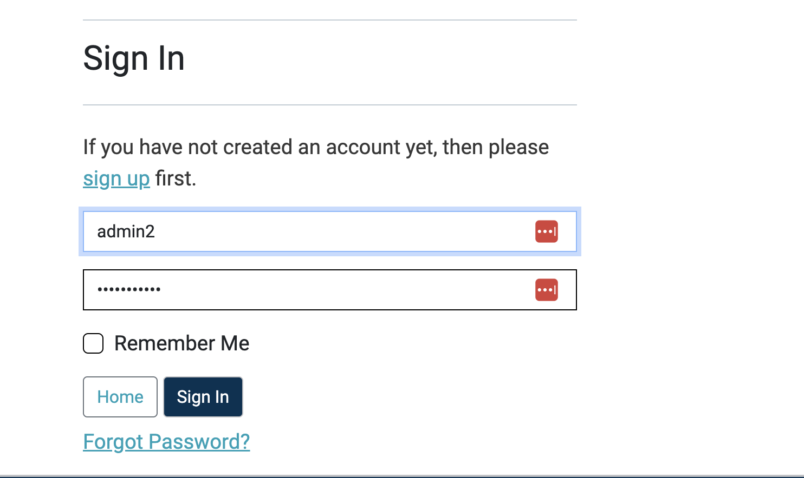

### Signup Page
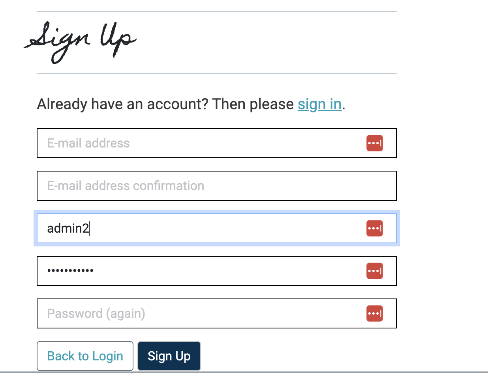
* After submitting the Signup form, the user will be redirected to this page, advising them to check the link sent to their email box.
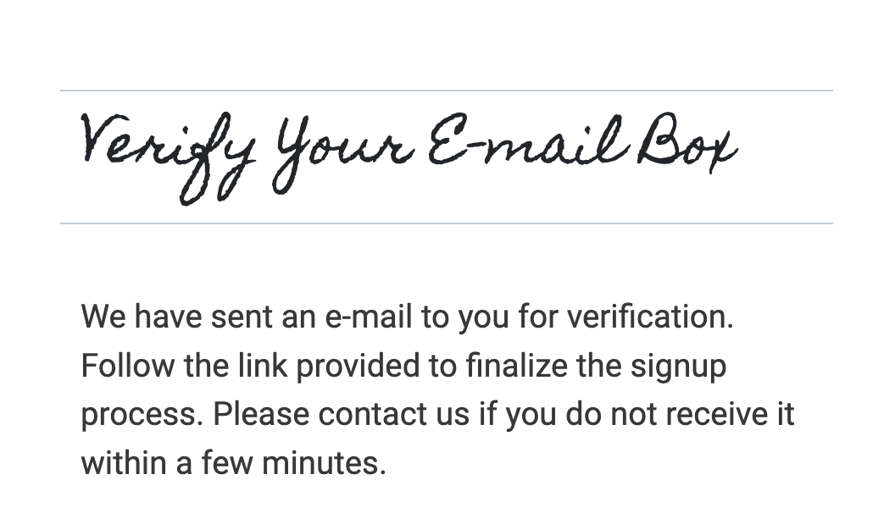
* After submitting the Signup form, the user will be redirected to this page, advising them to check the link sent to their email box.

* Once the user clicks on the link sent to their email box, it will redirect the user to this page which confirms their email.

### Logout Page
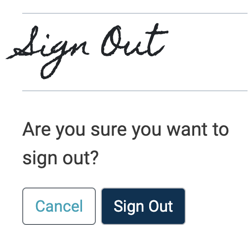
* Users can logout from any page and are asked to confirm their action.

### Products Listing
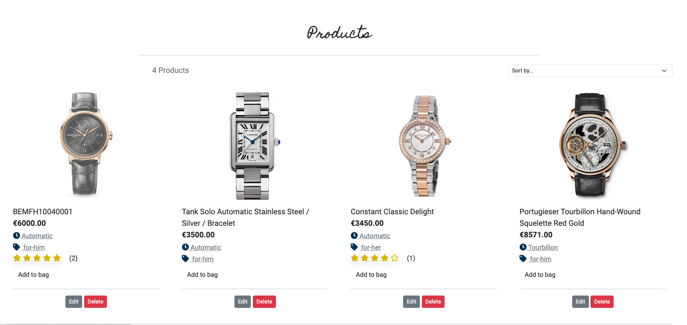
* The products page allow users to view all the products sold on the site. Users can visit the templates page which will display all products relating to templates. Or they can visit the designs products page which lists all design products.
* Users are provided already some product specific information and can interact with the list direction and categorization.
* Store admins have the possibility of deleting or modifying the information of the products.
* The 'Add to bag' button will take users to the product details page, so will the product image.

### Product Details Page & Review
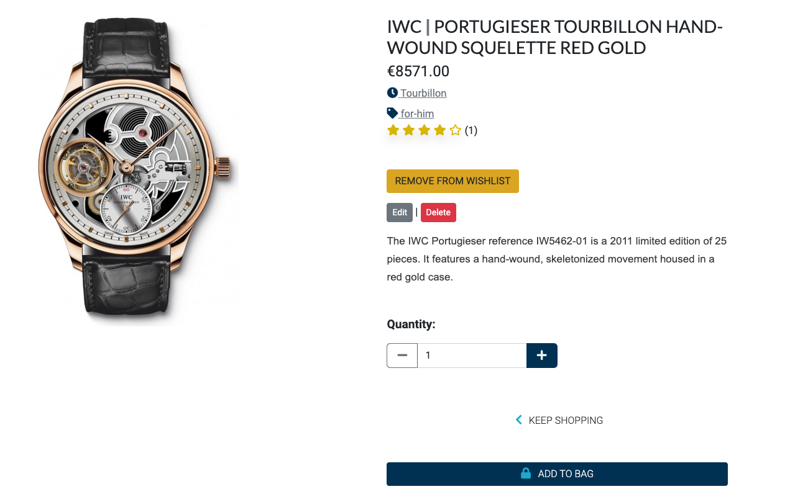
* Users can find general information from the page they land on about the product such as the price, the categories, the Brand, and how it is rate by other users.
* Users can add the item to their bag or go back to the previous page and find other products. 
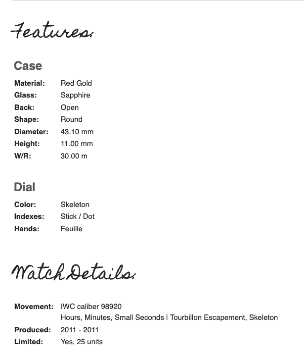
* By scrolling down, users can find additional information about the watch and characteristics of this specific model. 
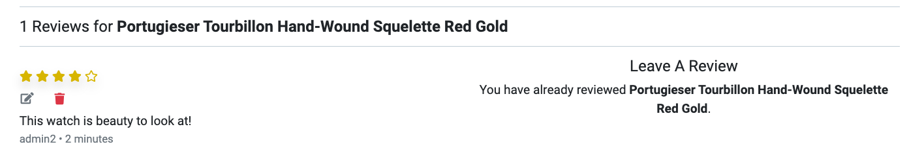
* At the bottom of the page, users can read the detail of the reviews posted about this specific product. If a user is not logged in, a message is asking to log in or sign up in order to post a review. If the user has already posted about this specific product, they cannot post a new message. Nonetheless, they <i>should</i> be able to amend their message. This functionality stopped working post deployment. However, deleting the review is possible.


### Shopping Bag

* The shopping bag is situated on the top right corner of the site and it is always visible for the user throughout all the pages. With one click they can access their shopping bag to see what is in there, update the quantities of products they wish to purchase or to delete them from the shopping bag
* The navbar is fully responsive, collapsing into a hamburger menu for medium and small screen size

### Checkout

### Checkout - Success

### Profile Page

### 404 Page

### Product Management

### Messages - Signup

### Messages - Checkout Confirmation

### Social Media
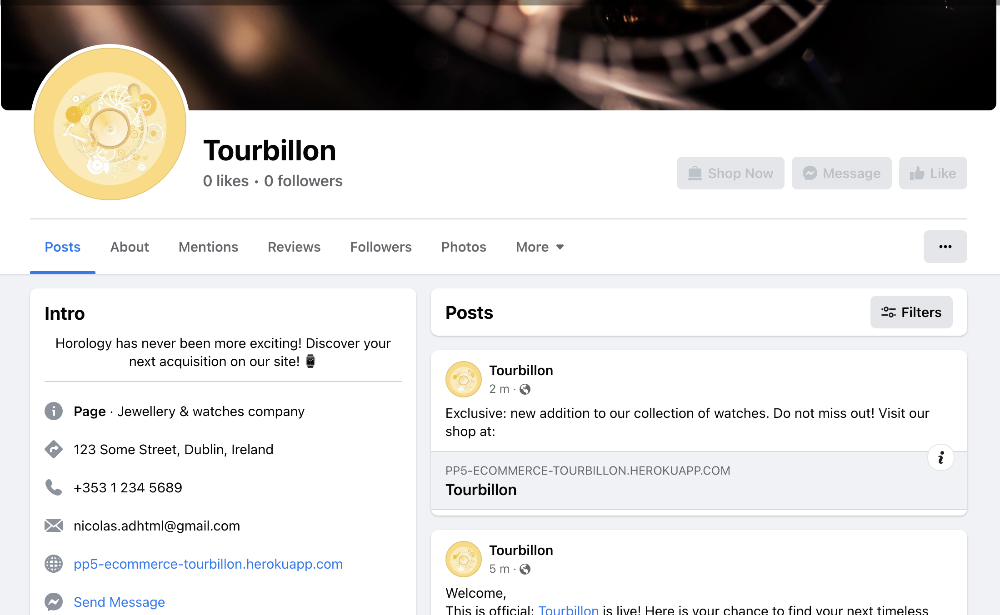

## Future Features
- Add stock on product to know if there are still products in store for sale. Otherwise, this product would uncheck the checkbox on product `available`. Extra logic would provide this information to website users.
- Back to top button

## Issues remaining
- When a user tries to modify a pubished review: `TemplateDoesNotExist` error message.
- Styling was not prioritised due to the time constraint. 


# Marketing Strategy (Optional)

- Who are your users? People that are already familiar with timeless watch pieces, people really enthusiast about watchmaking and people looking for luxury watches. 
- Which online platforms would you find lots of your users? Tourbillon users would be looking for the latest information on specialised platform, looking for news about new series being released, new watchmaking technology being incorporated in new watches coming from established houses, or casting their web in the search of their "holy grail" of watches.
- Would your users use social media? Yes, the users would be on 2 social media platforms mainly: Facebook (for customer support) and Instagram (for the latest addition to Tourbillon's stocks or news)
- What do your users need? Could you meet that need with useful content? If yes, how could you best deliver that content to them? The users would need news on what is happening in the world of watchmaking, updates on major information about what is about to be available for sales, updates on action they take on the website. In regards to the news and updates, punctual posts on the solcial media platform with a link to generate traffic towards the website/blog are critical. This will also help in the word-of-mouth strategy. A newsletter is also a good fit for the users of Tourbillon - the users are often looking for specific information. A/B testing could help pinpoint personal preferences and improve future targeting. 
- Would your business run sales or offer discounts? How do you think your users would most like to hear about these offers? Tourbillon's business would run on sales of exclusive timepieces difficult to find on the horologist.
- What are the goals of your business? Which marketing strategies would offer the best ways to meet those goals?
- Would your business have a budget to spend on advertising? Or would it need to work with free or low cost options to market itself?
<br>

# Search Engine Optimization (SEO)

- The site referencing is optimized following a careful selection of keywords relating to the universe of watches.
- The "brain dump" defines the different relevant topics relating to watches in order to be leveraged through the different apps in this project.
- The defined short/long tail keywords are based on my initial and humble understanding of the business.
- The keywords were chosen based on common topics and themes within the horology industry.
- To test the relevance of the keywords, each table entry was tested on Google. The number of results and several search suggestions after an initial search were added to the keyword list. The words that are in red and stricken out were not targeted in this project. Wordtracker helped identifying these keywords as too popular, which would be too difficult to target against better established actors.
- Words stricken out and faded were not included as they were not relevant or specific to the site.
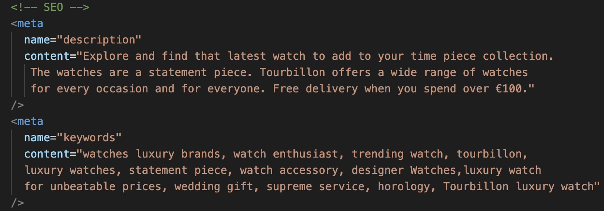

## Sitemap

- A sitemap file with a list of important URLs was added to ensure that search engines are able to easily navigate through the site and understand its structure. This was made using XML-sitemaps.com by following the steps:
  1. Paste the URL of the deployed site into XML-sitemaps,
  2. Download the XML sitemap file,
  3. Add the file into the projects root folder, named as "sitemap.xml".

## Robots.txt

- A robots.txt file was also created to increase the quality of the site. This file tells search engines where they are not to go on the website by listing the folders & files that will not be indexed or crawled. It ultimately improves the SEO ranking.
<br>

# Validation

## HTML Validation
HTML files that have been validated with W3.

* index.html / home.html
* products.html
* product_details.html
* add_product.html
* edit_product.html
* add_category.html
* edit_category.html
* bag.html
* checkout.html
* checkout_success.html
* questions.html
* add_question.html
* edit_question.html
* wishlist.html
* profiles.html
* 404.html

## W3C CSS Validator
Checked using W3C CSS Validator ensuring there were no errors or warnings present.

## Python Validation
I used autopep8 to validate all the Python files and checked them with Flake8.

## JSHint
I checked the JS files with JSHint for conformity.

# Privacy Policy

Users can consult the Privacy Policy for the eCommerce application through the Privacy link in the footer. This Privacy Policy was generated through the [Privacy Policy Generator](https://www.privacypolicygenerator.info/). This document was generated by inputting the Company name ("Tourbillon"), the Website name, and the website URL. This ensures users that the website and the processing of users' information complies with the European General Data Processing Regulation (GDPR) and the Provicy Policy rules.
We do not use cookies on the website and do not display Google AdSense to our users. Tourbillon does not display any advertising from 3rd parties as well. 

# Technologies

| Technology | Comment |
| :---: | :--- |
| [DrawSQL](https://drawsql.app/diagrams) | Used to design the ERD for WatchIt! |
| [Grammarly](https://www.grammarly.com/) |	Used to fix the grammar errors across the project. |
| [Baslamiq](https://balsamiq.com/)	| Used to create the wireframes for the website for the different supports. |
| [Coolors](https://coolors.co/) | Used to define the color palette for the website. |
| [Github](https://github.com/) | Used as the development environment. |
| [HTML](https://html.com/) | Used for the structure in all the templates of the website. |
| [CSS](https://www.w3schools.com/css/) | Used for styling the pages throughout the website. |
| [Bootstrap 5.2.3](https://blog.getbootstrap.com/2022/10/03/bootstrap-5-2-2/) | Used for layout and styling the pages throughout the website. |
| [Pep8](https://peps.python.org/pep-0008/)	| Used to test my code for any issues or errors. |
| [Django](https://www.djangoproject.com/) | Framework used to build the project and its apps. |
| [Django Star Ratings](https://django-star-ratings.readthedocs.io/en/latest/) | Used for rating and star-rating functionalities on the movies. |
| [Python](https://www.python.org/) | Python is the core programming language used to write all of the code in this application to make it fully functional. |
| [Heroku](https://dashboard.heroku.com/login) | Used to deploy the WatchIt! application. |
| [Google Fonts](https://fonts.google.com/) | Used to add the ratings on the movies through the Djanog model. |
| [AWS](https://aws.amazon.com/) | Used to store all of my static files and images. |
| [JavaScript](https://www.javascript.com/) | Used in a minimalist way. It is the supporting language for some of the packages used. It allows interaction with the user inputs. |
| [jQuery](https://jquery.com/) | jQuery is required in order to use the Owl Carousel components. |
| [Gunicorn](https://gunicorn.org/) | Gunicorn is used as the server for Heroku. |
| [Owl Carousel](https://owlcarousel2.github.io/OwlCarousel2/) | Used to display the movies and genres in a carousel. |
| [Django Crispy Form](https://django-crispy-forms.readthedocs.io/en/latest/index.html) | Used to control the rendering behavior of your Django forms. |
| [Crispy Bootstrap 5](https://github.com/django-crispy-forms/crispy-bootstrap5) | Used for Bootstrap5 for django-crispy-forms. |
| [Django Bootstrap DatePicker Plus](https://pypi.org/project/django-bootstrap-datepicker-plus/) | Used for date input in the forms. |
| [Font-Aweome](https://fontawesome.com/) | Used for the icons. |
| [Stripe](https://stripe.com/) | This solution is used to process all payments in the checkout process and to send webhooks on the status of those. |
| [Unsplash](https://unsplash.com/) | For the main background image. |
| [Watchbase](https://watchbase.com/) | For the watch details and images. |

## Github deployment

1. Go to the [Code Institute Gitpod Full Template](https://github.com/Code-Institute-Org/gitpod-full-template)
2. Click on Use This Template
3. Next you will need to add a gitignore file. To do this enter the command line: `touch .gitignore`
Inside this file add these 3 lines:
```
    *.sqlite3
    *.pyc
    __pycache__
```

## Creating the Django app

5. In your IDE, install Django and gunicorn with `pip3 install 'django<4' gunicorn`
6. Install supporting database libraries dj_database_url and psycopg2: `pip3 install dj_database_url psycopg2`
7. To create file for requirements, in the terminal window type `pip freeze --local > requirements.txt`
8. Create project: in the terminal window type `django-admin startproject *your_project_name*`
9. Create app: in the terminal window type `python3 manage.py startapp *your_app_name*`
10. Add your app to the list of installed apps in settings.py file: *you_app_name*
11. Migrate changes: in the terminal window type `python3 manage.py migrate`
12. Run the server to test if the app is installed, in the terminal "The install worked successfully! Congratulations!"

## Install Allauth

1. Install the Python package with `pip3 install django-allauth`
2. Verify that ‘django.contrib.sites’ is in the INSTALLED_APPS of the settings.py file

## Stripe
1. Register for an account at stripe.com
2. Go to Developers section once logged in
3. Go to API keys section
1. Note both the publishable and secret keys
1. In your local environment(env.py) and Heroku, create environment variables `STRIPE_PUBLIC_KEY` and `STRIPE_SECRET_KEY` with the publishable and secret key values `os.environ.setdefault('STRIPE_PUBLIC_KEY', 'YOUR_VALUE_GOES_HERE')` `os.environ.setdefault('STRIPE_SECRET_KEY', 'YOUR_VALUE_GOES_HERE')`
1. Back in the Developers section of your stripe account click on Webhooks
1. Create a webhook with the url of your website `/checkout/wh/`, for example:
    1. Select the payment_intent.payment_failed and payment_intent.succeeded as events to send
    1. Note the key created for this webhook
1. In your local environment(env.py) and Heroku, create environment variable `STRIPE_WH_SECRET` with the secret values os.`environ.setdefault('STRIPE_WH_SECRET', 'YOUR_VALUE_GOES_HERE')`
1. Test the webhook and note the success/fail attempts for troubleshooting, see events and logs for further testing.

## Amazon WebServices
1. Create an account at aws.amazon.com
1. Open the S3 application and create an S3 bucket
1. Select AWS Region.
1. Uncheck the "Block All Public access setting" & acknowledge that the bucket will be public, it will need to be public in order to allow public access to static files.
1. In the Properties section, navigate to the "Static Website Hosting" section and click edit
1. Under the Properties section, turn on "Static Website Hosting", and set the index.html and the error.html values.
1. In the Permissions section, click edit on the CORS configuration and set the below configuration
1. Click to edit the bucket policy and generate and set the below configuration:
Bucket policy
1. Go to the Access Control List and set the List objects permission for everyone under the Public Access section.
1. Open the IAM application to control access to the bucket and set up a user group called
1. Click on Policies, and Create Policy.
1. Click on the JSON tab and import a pre-built Amazon policy called AmazonS3FullAccess:
1. Set the following settings in the JSON tab:
1. Click Review Policy, give it a name and description and click Create Policy.
1. To attach the policy to the group, navigate to Groups, then Permissions, and under Add Permissions, select Attach Policy.
1. To create a user for the group, click Add User, and create one
1. Add the user to the group created, making sure to download the CSV file which contains the user's access credentials.
1. Note the following AWS code in Settings.py. An environment variable called USE_AWS must be set to use these settings, otherwise it will use local storage:

## Google Email
1. Create an email account at google.com, login, go to accounts settings in your gmail account and then click on Other Google Account Settings
1. Go to accounts and import then click on other account settings
1. Under signing into Google, turn on 2-step verification and follow the steps to enable
1. Once verified click on app passwords, select Other as the app and give the password a name, for example Django
1. Click create and a 16 digit password will be generated, copy this 16 digit password
1. In the env.py file, create an environment variable called `EMAIL_HOST_PASS` with the 16 digit password
1. In the env.py file, create an environment variable called `EMAIL_HOST_USER` with the email address of the gmail account
1. Set and confirm the following values in the settings.py file to successfully send emails
You will also need to set the variables `EMAIL_HOST_PASS` and `EMAIL_HOST_USER` in your production instance, for example Heroku

## Deployment
1. This project was developed using a GitPod workspace. The code was committed to Git and pushed to GitHub using the terminal.
1. Log in to Heroku or create an account
1. On the main page click New and Create New App
1. Note: new app name must be unique
1. Next select your region, I chose Europe.
1. Click Create App button
1. Click in resources and select Heroku Postgres database
1. Click Reveal Config Vars and add new config `SECRET_KEY`
1. Click Reveal Config Vars and add new config `DISABLE_COLLECTSTATIC = 1`
1. The next page is the project’s Deploy Tab. Click on the Settings Tab and scroll down to Config Vars
1. Next, go to Buildpack section click Add Buildpack select python and Save Changes
1. Scroll to the top of the page and choose the Deploy tab
1. Select Github as the deployment method
1. Confirm you want to connect to GitHub
1. Search for the repository name and click the connect button
1. Scroll to the bottom of the deploy page and select the preferred deployment type
1. Click either Enable Automatic Deploys for automatic deployment when you push updates to Github
1. As Heroku Student Pack no longer includes free access to the Postgres add-on I had to migrate Postgres databases from Heroku to keep ElephantSQL.
1. Navigate to ElephantSQL.com and click “Get a managed database today”
Select “Try now for FREE” in the TINY TURTLE database plan
1. Select “Log in with GitHub” and authorize ElephantSQL with your selected GitHub account
1. In the Create new team form

## Migrating databases
1. Create a database
1. Log in to ElephantSQL.com to access your dashboard
1. Click “Create New Instance”
1. Set up your plan
1. Select “Select Region” EXAMPLE "EU-West-1 (Ireland)"
1. Then click “Review”
1. Check your details are correct and then click “Create instance”
1. Return to the ElephantSQL dashboard and click on the database instance name for this project
1. Migrating your data
1. Navigate to the Postgres Migration Tool repo on github in a new browser tab
1. Click the Gitpod button to open a new workspace
1. In a different browser tab, go to your app in Heroku and select the Settings tab
1. Click the “Reveal Config Vars” button
1. Copy the value in the `DATABASE_URL` Config Var. It will start with postgres://
1. Return to Gitpod and paste in the URL you just copied into the terminal where prompted to provide your `DATABASE_URL` and click enter
1. In your original browser tab, get your ElephantSQL database URL. Again, it will start with postgres://
1. Return to Gitpod and paste in the URL where prompted
1. The data will now be downloaded from Heroku and uploaded to your ElephantSQL database
1. To test that your database has been moved successfully, return to ElephantSQL and select BROWSER
1. Click the “Table queries” button. If you see any options in the dropdown, your tables have been created
1. Select a table name you recognise, and then click “Execute”
1. You should see your data displayed relating to the table you selected
1. Connecting ElephantSQL database to Heroku
1. In the Heroku Dashboard for your project, open the Resources tab
1. In the Resources tab, remove the existing Postgres add-on:
1. Confirm by typing in the name of your Heroku app when prompted.
1. Navigate to the Settings tab
1. Reveal your existing Config Vars. The original `DATABASE_URL` should have been deleted when the add-on was removed.
1. Add a new config var called `DATABASE_URL` and paste in the value for your ElephantSQL database, and click Add to save it.
1. Check the Activity tab to confirm

## Final Deployment
1. Create a runtime.txt python-3.11
1. Create a Procfile
1. When development is complete change the debug setting to: `DEBUG = False` in settings.py
1. In Heroku settings, delete the config vars for `DISABLE_COLLECTSTATIC = 1`
1. Forking This Project
1. Open GitHub
1. Find the 'Fork' button at the top right of the page
1. Once you click the button the fork will be in your repository


## Cloning This Project / Local Deployment
1. Clone this project by following the steps:
1. Open GitHub
1. You will be provided with three options to choose from, HTTPS, SSH or GitHub CLI, click the clipboard icon in order to copy the URL
1. Once you click the button the fork will be in your repository
1. Open a new terminal
1. Change the current working directory to the location that you want the cloned directory
1. Type 'git clone' and paste the URL copied in step 3
```git clone https://github.com/nfepb/CI-PP5-eCommerce-Tourbillon```
1. Press 'Enter' and the project is cloned to your workspace
1. Create an env.py file(do not commit this file to source control) in the root folder in your project, and add in the following code with the relevant key, value pairs, and ensure you enter the correct key values<br>

<br><code>import os</code>
<br><code>os.environ["SECRET_KEY"]= 'TO BE ADDED BY USER'</code>
<br><code>os.environ["STRIPE_PUBLIC_KEY"]= 'TO BE ADDED BY USER'</code>
<br><code>os.environ["STRIPE_SECRET_KEY"]= 'TO BE ADDED BY USER'</code>
<br><code>os.environ["STRIPE_WH_SECRET"]= 'TO BE ADDED BY USER'</code>
<br><code>os.environ["AWS_ACCESS_KEY_ID"]= 'TO BE ADDED BY USER'</code>
<br><code>os.environ["AWS_SECRET_ACCESS_KEY"]= 'TO BE ADDED BY USER'</code>
<br><code>os.environ["EMAIL_HOST_USER"]= 'TO BE ADDED BY USER'</code>
<br><code>os.environ["EMAIL_HOST_PASS"]= 'TO BE ADDED BY USER'</code>
<br><code>os.environ["USE_AWS"]= 'TO BE ADDED BY USER'</code>
<br><code>os.environ["DATABASE_URL"]= 'TO BE ADDED BY USER'</code>
<br><code>os.environ["DEVELOPMENT"] ='True'</code>

1. Some values for the environment variables above are described in different sections of this readme
1. Install the relevant packages as per the requirements.txt file
1. In the settings.py ensure the connection is set to either the Heroku postgres database or the local sqlite database
1. Ensure debug is set to true in the settings.py file for local development
1. Add localhost to the `ALLOWED_HOSTS` variable in settings.py
1. Run `python3 manage.py showmigrations` to check the status of the migrations
1. Run `python3 manage.py migrate` to migrate the database
1. Run `python3 manage.py createsuperuser` to create a super/admin user
1. Start the application by running `python3 manage.py runserver`
1. Open the application in a web browser, 

# Credits
* Code Institute - [Boutique Ado](https://learn.codeinstitute.net/courses/course-v1:CodeInstitute+EA101+2021_T1/courseware/eb05f06e62c64ac89823cc956fcd8191/3adff2bf4a78469db72c5330b1afa836/) -  Walkthrough
* Code Institute - [Hello Django](https://learn.codeinstitute.net/courses/course-v1:CodeInstitute+FST101+2021_T1/courseware/dc049b343a9b474f8d75822c5fda1582/121ef050096f4546a1c74327a9113ea6/) -  Walkthrough
* Code Institute - [I think therefore I blog](https://learn.codeinstitute.net/courses/course-v1:CodeInstitute+FST101+2021_T1/courseware/b31493372e764469823578613d11036b/fe4299adcd6743328183aab4e7ec5d13/
) - Django blog project Walkthrough

## Content

## Media

## Acknowledgements
* To create this website, I relied on material covered in the Full Stack Development course by Code Institute.
* I also sourced information and help from a variety of sources such as Slack Community Channels, Udemy, W3Schools, MDN and YouTube for Online Web Tutorials and resources.
* Ronan for being a great mentor and helping me to undertstand how to build a more robust application.
* Amelle for feeding me and supporting me during my long days and nights stuck at the keyboard.

This project is for educational use only and was created for the Code Institute e-commerce course.