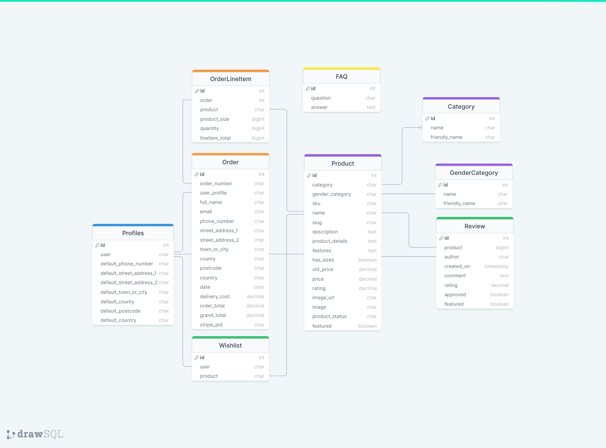
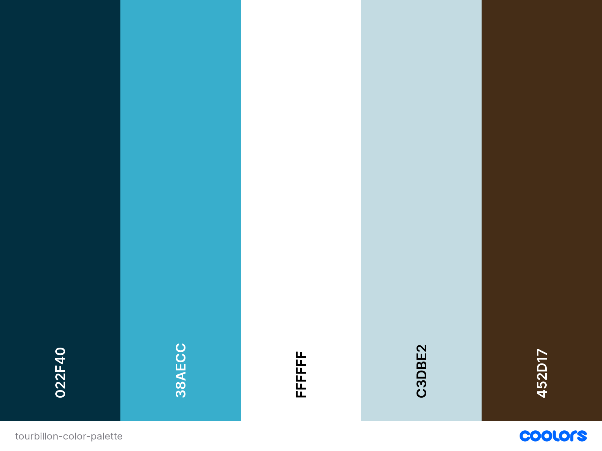

# PP5-eCommerce-Tourbillon


# Strategy Plane

## App's Goals

* To provide the users with a pleasant experience on the website where they read more about the offered watches.
* To provide users with an intuitive and secure checkout process to purchase the imtes they are interested in.
* To allow users to share their thoughts on their favorite items.
* To allow the store admin users to approve, update and delete reviews from the frontend.
* To provide users with clear and adequate responses based on their input or actions.

# Scope Plane

## User Experience (UX)

### User Stories

The user stories are categories in 3 classes of users:
- Visitor, as a user visiting the website and discovering the brand and the services of the app,
- Customer, as a user that is logged in,
- Store Administrator, as a superuser with full access.

1. As a <strong>Visitor</strong>, I can:
    01. Understand the purpose of this website from the homepage,
        * to identify the value proposition.
    02. Navigate around the site and easily find the desired content,
        * to access information that I look for.
    02. View the list of products and filter lists on chosen categories,
        * to identify items that I find interesting.
    03. Search for products to find a specific item on the app,
        * to easily consult information on specific items.
    04. Click on a product to view its details,
        * to read more on items I find interesting.
    06. View product ratings and comments so that I can read other users' opinions,
        * to be better informed on other Tourbillon's users experience of this specific product.
    05. Register for an account to access the services available to members.
        * to have a personalised account and access restricted areas of the site based on my profile.
    06. Add a product to my shopping bag,
        * to purchase items I wish to acquire.
    07. Access my shopping bag,
        * to update quantities or remove items and view the total cost.
    07. Buy a product by using the website checkout system,
        * to check out quickly and in a secure environment.
    08. Signup for the newsletter,
        * to stay up to date with the latest addition to Tourbillon's catalog.
    <br>
    <br>
2. As a <strong>Customer</strong>, I can:<br>
    01. View my previous orders,
        * to keep track of my previous purchases.
    02. Post a review on a product,
        * to share my experience and thoughts with Tourbillon's community.
    03. Update or Delete a previously posted review.
        * to own the content that I post on Tourbillon's app. 
    04. Save my information to my profile,
        * to make the checkout process easier for future purchases.
    06. Checkout without having to fill in my previously saved information,
        * to make the checkout process more seamless and improve the customer experience.
    <br>
    <br>

3. As a <strong>Store Administrator</strong>, I can:
    01. Create a draft of a new product,
        * to work on products on the backend.
    02. Manage products,
        * to keep product information up to date and publish only selected products on the website.
    03. Create & manage categories,
        * to link products to categories and make product filtering easier.
    04. Delete products & categories,
        * to remove categories that are no longer going to be used.
    06. Approve users' published reviews,
        * to manage the community engagement and only allow useful comments to be posted.
    07. Publish and manage a FAQ visible on the website,
        * to allow users to find up-to-date information on the questions they ask themselves.

## Agile Methodology

The principles of the Agile Methodology framed how this project was tackled. The GitHub project management tools were used to keep track of the different sprints. They can be found [here](https://github.com/users/nfepb/projects/5/views/2?visibleFields=%5B%22Title%22%2C%22Status%22%2C%22Labels%22%2C%22Milestone%22%5D).

The status of the issues tracked through 3 different sections:

* 📚 Backlog
* 🚧 In Progress
* ✅ Done

The websites of several watch houses helped me define what were some of the critical features to get to a MVP, and which features were considered 'nice to have' for later development. The ones this project takes most inspiration from in terms of features are the [Longines](https://www.longines.com/), the [Rolex](https://www.rolex.com/), and the [Chrono24](https://www.chrono24.fr/) websites.

# Structure Plane

## Database Diagram 



## Typography

* <i>Monsieur La Doulaise</i> is used for the site logo.
* <i>Montserrat</i> is used for the rest of the content of the site, including headers.

## Colours



The name of the app, "Tourbillon" has two definitions. In watchmaking (or horology), it defines a type of watch escapement to increase the accuracy. In French, a tourbillon is used to define a whirlwind. The main colour chosen, Prussian Blue, Pacific Blue, and White are used to reference colour of the sea in turmoil. The Columbia Blue and Cafe Noir are there to reference respectively the casing foa watch, along with its brown leather strap.

## Images

## Wireframes

The mobile and desktop for this project can be found [here]()

# Surface Plane

## Features

### Navbar

### Footer

### Home Page

### Login Page

### Signup Page

### Logout Page

### Products Listing

### Product Details Page

#### Review

### Shopping Bag

### Checkout

### Checkout - Success

### Profile Page

### 404 Page

### Product Management

### Messages - Signup

### Messages - Checkout Confirmation

## Future Features


# Marketing Strategy (Optional)

- Who are your users? People that are already familiar with timeless watch pieces, people really enthusiast about watchmaking and people looking for luxury watches. 
- Which online platforms would you find lots of your users? Tourbillon users would be looking for the latest information on specialised platform, looking for news about new series being released, new watchmaking technology being incorporated in new watches coming from established houses, or casting their web in the search of their "holy grail" of watches.
- Would your users use social media? Yes, the users would be on 2 social media platforms mainly: Facebook (for customer support) and Instagram (for the latest addition to Tourbillon's stocks or news)
- What do your users need? Could you meet that need with useful content? If yes, how could you best deliver that content to them? The users would need news on what is happening in the world of watchmaking, updates on major information about what is about to be available for sales, updates on action they take on the website. In regards to the news and updates, punctual posts on the solcial media platform with a link to generate traffic towards the website/blog are critical. This will also help in the word-of-mouth strategy. A newsletter is also a good fit for the users of Tourbillon - the users are often looking for specific information. A/B testing could help pinpoint personal preferences and improve future targeting. 
- Would your business run sales or offer discounts? How do you think your users would most like to hear about these offers? Tourbillon's business would run on sales of exclusive timepieces difficult to find on the horologist.
- What are the goals of your business? Which marketing strategies would offer the best ways to meet those goals?
- Would your business have a budget to spend on advertising? Or would it need to work with free or low cost options to market itself?
<br>

# Search Engine Optimization (SEO)

- The site referencing is optimized following a careful selection of keywords relating to the universe of watches.
- The "brain dump" defines the different relevant topics relating to watches in order to be leveraged through the different apps in this project.
- The defined short/long tail keywords are based on my initial and humble understanding of the business.
- The keywords were chosen based on common topics and themes within the horology industry.
- To test the relevance of the keywords, each table entry was tested on Google. The number of results and several search suggestions after an initial search were added to the keyword list. The words that are in red and stricken out were not targeted in this project. Wordtracker helped identifying these keywords as too popular, which would be too difficult to target against better established actors.
- Words stricken out and faded were not included as they were not relevant or specific to the site.

## Sitemap

- A sitemap file with a list of important URLs was added to ensure that search engines are able to easily navigate through the site and understand its structure. This was made using XML-sitemaps.com by following the steps:
  1. Paste the URL of the deployed site into XML-sitemaps,
  2. Download the XML sitemap file,
  3. Add the file into the projects root folder, named as "sitemap.xml".

## Robots.txt

- A robots.txt file was also created to increase the quality of the site. This file tells search engines where they are not to go on the website by listing the folders & files that will not be indexed or crawled. It ultimately improves the SEO ranking.
<br>

# Privacy Policy

Users can consult the Privacy Policy for the eCommerce application through the Privacy link in the footer. This Privacy Policy was generated through the [Privacy Policy Generator](https://www.privacypolicygenerator.info/). This document was generated by inputting the Company name ("Tourbillon"), the Website name, and the website URL. This ensures users that the website and the processing of users' information complies with the European General Data Processing Regulation (GDPR) and the Provicy Policy rules.
We do not use cookies on the website and do not display Google AdSense to our users. Tourbillon does not display any advertising from 3rd parties as well. 

# Technologies

| Technology | Comment |
| :---: | :--- |
| [DrawSQL](https://drawsql.app/diagrams) | Used to design the ERD for WatchIt! |
| [Grammarly](https://www.grammarly.com/) |	Used to fix the grammar errors across the project. |
| [Baslamiq](https://balsamiq.com/)	| Used to create the wireframes for the website for the different supports. |
| [Coolors](https://coolors.co/) | Used to define the color palette for the website. |
| [Github](https://github.com/) | Used as the development environment. |
| [HTML](https://html.com/) | Used for the structure in all the templates of the website. |
| [CSS](https://www.w3schools.com/css/) | Used for styling the pages throughout the website. |
| [Bootstrap 5.2.3](https://blog.getbootstrap.com/2022/10/03/bootstrap-5-2-2/) | Used for layout and styling the pages throughout the website. |
| [Pep8](https://peps.python.org/pep-0008/)	| Used to test my code for any issues or errors. |
| [Django](https://www.djangoproject.com/) | Framework used to build the project and its apps. |
| [Django Star Ratings](https://django-star-ratings.readthedocs.io/en/latest/) | Used for rating and star-rating functionalities on the movies. |
| [Python](https://www.python.org/) | Python is the core programming language used to write all of the code in this application to make it fully functional. |
| [Heroku](https://dashboard.heroku.com/login) | Used to deploy the WatchIt! application. |
| [Google Fonts](https://fonts.google.com/) | Used to add the ratings on the movies through the Djanog model. |
| [AWS](https://aws.amazon.com/) | Used to store all of my static files and images. |
| [JavaScript](https://www.javascript.com/) | Used in a minimalist way. It is the supporting language for some of the packages used. It allows interaction with the user inputs. |
| [jQuery](https://jquery.com/) | jQuery is required in order to use the Owl Carousel components. |
| [Gunicorn](https://gunicorn.org/) | Gunicorn is used as the server for Heroku. |
| [Owl Carousel](https://owlcarousel2.github.io/OwlCarousel2/) | Used to display the movies and genres in a carousel. |
| [Django Crispy Form](https://django-crispy-forms.readthedocs.io/en/latest/index.html) | Used to control the rendering behavior of your Django forms. |
| [Crispy Bootstrap 5](https://github.com/django-crispy-forms/crispy-bootstrap5) | Used for Bootstrap5 for django-crispy-forms. |
| [Django Bootstrap DatePicker Plus](https://pypi.org/project/django-bootstrap-datepicker-plus/) | Used for date input in the forms. |
| [Font-Aweome](https://fontawesome.com/) | Used for the icons. |
| [Stripe](https://stripe.com/) | This solution is used to process all payments in the checkout process and to send webhooks on the status of those. |

## Github deployment

1. Go to the [Code Institute Gitpod Full Template](https://github.com/Code-Institute-Org/gitpod-full-template)
2. Click on Use This Template
3. Next you will need to add a gitignore file. To do this enter the command line: `touch .gitignore`
Inside this file add these 3 lines:
```
    *.sqlite3
    *.pyc
    __pycache__
```

## Creating the Django app

5. In your IDE, install Django and gunicorn with `pip3 install 'django<4' gunicorn`
6. Install supporting database libraries dj_database_url and psycopg2: `pip3 install dj_database_url psycopg2`
7. To create file for requirements, in the terminal window type `pip freeze --local > requirements.txt`
8. Create project: in the terminal window type `django-admin startproject *your_project_name*`
9. Create app: in the terminal window type `python3 manage.py startapp *your_app_name*`
10. Add your app to the list of installed apps in settings.py file: *you_app_name*
11. Migrate changes: in the terminal window type `python3 manage.py migrate`
12. Run the server to test if the app is installed, in the terminal "The install worked successfully! Congratulations!"

## Install Allauth

1. Install the Python package with `pip3 install django-allauth`
2. Verify that ‘django.contrib.sites’ is in the INSTALLED_APPS of the settings.py file.

# Credits

## Content

## Media

## Acknowledgements