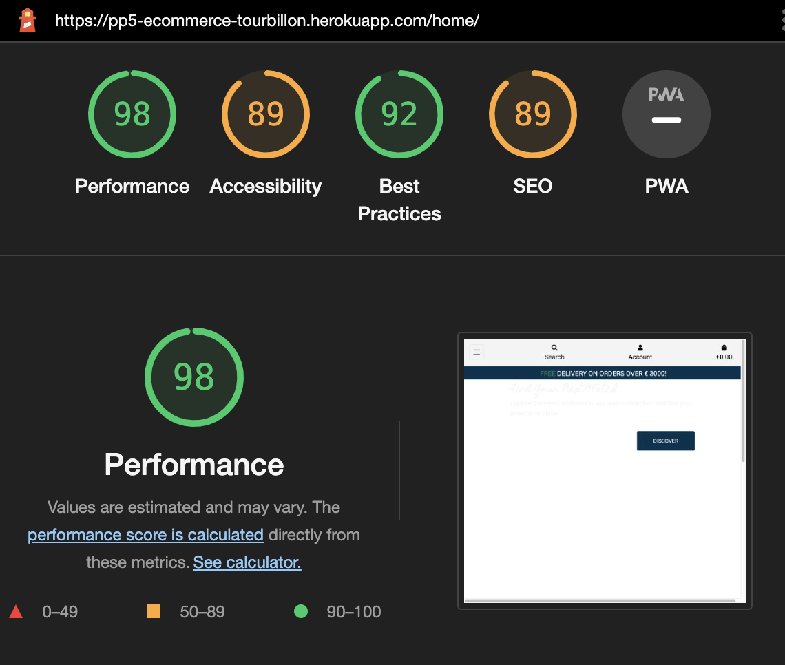

# Lighthouse

# HTML

# JSHINT
* All JavaScript passed through JSHint:
    * Base_script
    * Checkout_script
    * Quantity_input_script
    * Product Script
    * bag Script

* All warning were regarding the use of ES6 and can be disregarded.

# PEP8
* I used autopep8 to validate all the Python files. Pylint and Pylint-Django were used to make sure that errors were tackled as soon as they arose.

# Use Stories Testing

## Epic: Visitor

1. As a <strong>Visitor</strong>, I can:
    01. Understand the purpose of this website from the homepage,
        * to identify the value proposition.
    02. Navigate around the site and easily find the desired content,
        * to access information that I look for.
    02. View the list of products and filter lists on chosen categories,
        * to identify items that I find interesting.
    03. Search for products to find a specific item on the app,
        * to easily consult information on specific items.
    04. Click on a product to view its details,
        * to read more on items I find interesting.
    06. View product ratings and comments so that I can read other users' opinions,
        * to be better informed on other Tourbillon's users experience of this specific product.
    05. Register for an account to access the services available to members.
        * to have a personalised account and access restricted areas of the site based on my profile.
    06. Add a product to my shopping bag,
        * to purchase items I wish to acquire.
    07. Access my shopping bag,
        * to update quantities or remove items and view the total cost.
    07. Buy a product by using the website checkout system,
        * to check out quickly and in a secure environment.
    08. Signup for the newsletter,
        * to stay up to date with the latest addition to Tourbillon's catalog.
     
     
## Epic: Customer
2. As a <strong>Customer</strong>, I can: 
    01. View my previous orders,
        * to keep track of my previous purchases.
    02. Post a review on a product,
        * to share my experience and thoughts with Tourbillon's community.
    03. Update or Delete a previously posted review.
        * to own the content that I post on Tourbillon's app. 
    04. Save my information to my profile,
        * to make the checkout process easier for future purchases.
    06. Checkout without having to fill in my previously saved information,
        * to make the checkout process more seamless and improve the customer experience.
     
     
## Epic: Store Administrator
3. As a <strong>Store Administrator</strong>, I can:
    01. Create a draft of a new product,
        * to work on products on the backend.
    02. Manage products,
        * to keep product information up to date and publish only selected products on the website.
    03. Create & manage categories,
        * to link products to categories and make product filtering easier.
    04. Delete products & categories,
        * to remove categories that are no longer going to be used.
    06. Approve users' published reviews,
        * to manage the community engagement and only allow useful comments to be posted.
    07. Publish and manage a FAQ visible on the website,
        * to allow users to find up-to-date information on the questions they ask themselves.