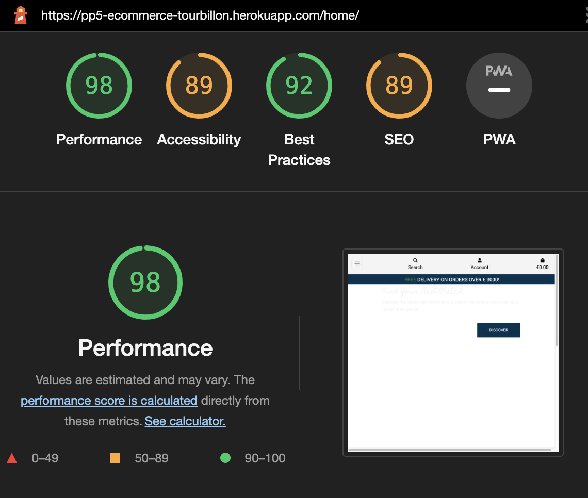
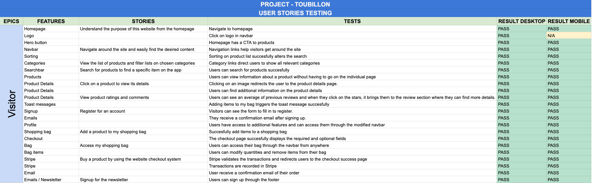
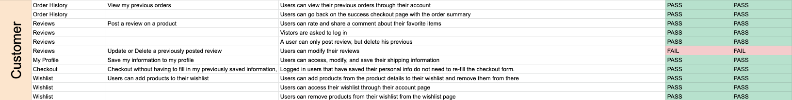
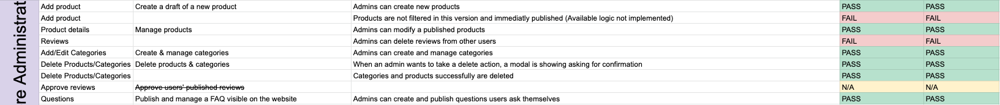

# Lighthouse

* Some drop in performance are caused by unused JS coming through jQuery.
* Main background image can be changed format to .webp to improve performance.

# HTML

# Validation

## HTML Validation
HTML files that have been validated with W3.

* index.html / home.html
* products.html
* product_details.html
* add_product.html
* edit_product.html
* add_category.html
* edit_category.html
* bag.html
* checkout.html
* checkout_success.html
* questions.html
* add_question.html
* edit_question.html
* wishlist.html
* profiles.html
* 404.html

* Some errors were identified caused by django includes.
* Some minor issues (stray tag)
* One form that does not have an action - this is a form in the menu. It can be disregarded. The code is from Bootstrap.

## W3C CSS Validator
Checked using W3C CSS Validator ensuring there were no errors or warnings present.

# JSHINT
* All JavaScript passed through JSHint:
    * Base_script
    * Checkout_script
    * Quantity_input_script
    * Product Script
    * bag Script

* All warning were regarding the use of ES6 and can be disregarded.

# PEP8
* I used autopep8 to validate all the Python files. Pylint and Pylint-Django were used to make sure that errors were tackled as soon as they arose.

# Use Stories Testing

## Visitor

* The live spreadsheet can be found [here](https://docs.google.com/spreadsheets/d/1xVitEK0IMJg2WByTJi8ohOe9DsFLb5DQtrN9N_3hFAg/edit#gid=0)

# Issues remaining

* Bootstrap toast issue in the console. Can be disregarded
* Script for back to top button (WIP)